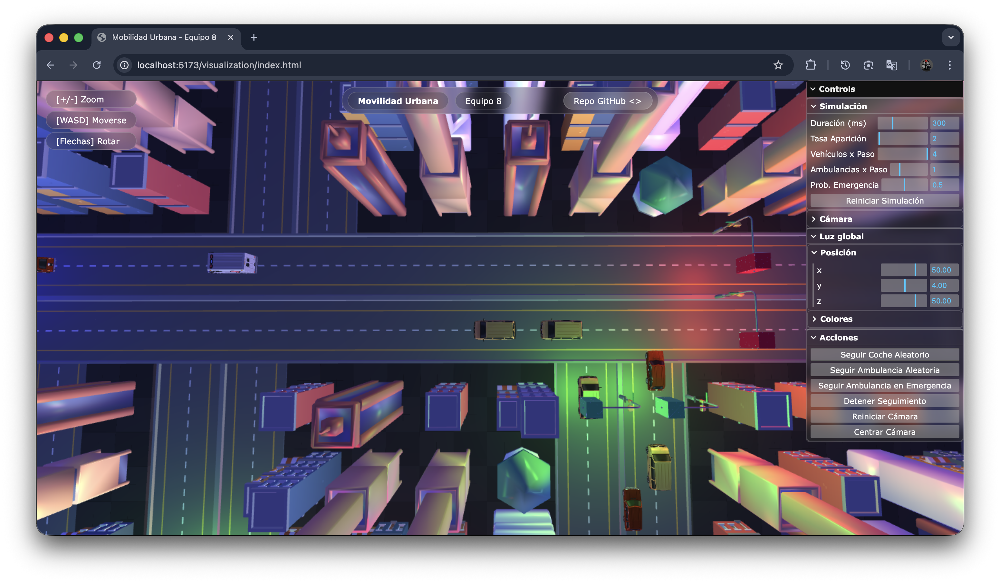

# TC2008B_Equipo8

# :city_sunrise: Reto - Movilidad urbana 
## :vertical_traffic_light: . . :car: . :ambulance: . :blue_car: . :taxi: . :articulated_lorry: . . . . . :busstop:


---

## :clipboard: Información general

**Bloque:** TC2008B - Modelación de sistemas multiagentes con gráficas computacionales

**Grupo:** 301

**Equipo 8:**
- Aquiba Yudah Benarroch Bittan - A01783710
- Diego Córdova Rodríguez - A01781166
- Lorena Estefanía Chewtat Torres - A01785378

---

### :camera_flash: Visualización y Características

**Visualización 3D** con WebGL para renderizado en tiempo real


**Seguimiento de vehículos** con datos de posición y estado


**Gestión inteligente de tráfico** y toma de decisiones multiagente


---

## :memo: Descripción

> **Objetivo:** Desarrollar una simulación multiagente que modele el tráfico urbano, permitiendo evaluar y visualizar estrategias para mejorar la movilidad y reducir la congestión vehicular en ciudades mexicanas.

Este proyecto propone una solución basada en una simulación multiagente y visualización gráfica para abordar la movilidad urbana en México, proponiendo soluciones para reducción de congestión vehicular.

La simulación modela agentes como vehículos y semáforos, permitiendo evaluar estrategias que disminuyan el número de vehículos en circulación, tomando así el camino menos congestionado para mejorar la movilidad de la ciudad.


---

## :rocket: Instalación y Configuración

### 1. Clonar el Repositorio

```bash
git clone git@github.com:diegocrdz/TC2008B_Equipo8.git
cd TC2008B_Equipo8
```

### 2. Crear Entorno Virtual

**Windows:**
```bash
python -m venv .agents
source .agents/Scripts/activate
```

**Linux/Mac:**
```bash
python3 -m venv .agents
source .agents/bin/activate
```

### 3. Instalar Dependencias de Python
```bash
pip install -U mesa[all]
pip install flask flask-cors
```

### 4. Instalar Dependencias de Node.js (para la visualización 3D)
```bash
cd AgentsVisualization
npm install
```

---

## :computer: Ejecución de la Simulación

### Opción 1: Simulación en 2D (Solara)
```bash
cd AgentsVisualization/Server/trafficServer
solara run server.py
```

### Opción 2: Simulación en 3D (Vite + Flask)
**Terminal 1 - Servidor Flask (Backend):**
```bash
cd AgentsVisualization/Server/trafficServer
python traffic_server.py
```

**Terminal 2 - Servidor Vite (Frontend):**
```bash
cd AgentsVisualization
npx vite
```